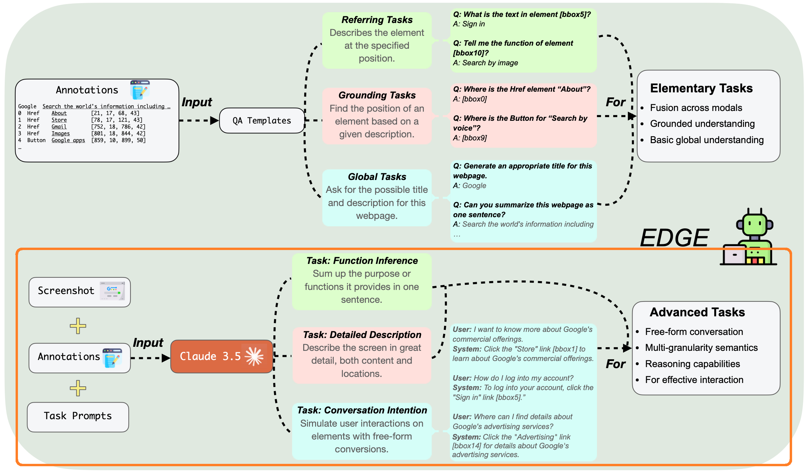

# Advanced Task Generation



Here we provide flexible and customizable scripts for generation of *advanced task* data described in the paper and depicted in the picture above. 

Requests will be concurrently sent to the proprietary model.

> Refer to [../annotate_webpages/](../annotate_webpages/README.md) to see and use our Node.js scripts for automatically annotating webpages.

## Usage

### Running Script

- example
  ```bash
  python main.py --task-type convers_intent --webpage-dir test_webpage --page-part top,mid --cover-exist
  ```
  > In [test_webpage/](./test_webpage/anno/0000020_top.json) we've provided annotation results of three different webpages for test. 
  >
  > The results will be under `test_webpage/intention`. Similar for `--task-type func_infer` and `--task-type --detail_desc`.


- check usage

  ```bash
  python main.py -h
  ```
  ```
  usage: main.py [-h] --task-type {func_infer,detail_desc,convers_intent} --webpage-dir WEBPAGE_DIR [--page-part PAGE_PART] [--cover-exist] [--max-id MAX_ID]

  optional arguments:
    -h, --help            show this help message and exit
    --task-type {func_infer,detail_desc,convers_intent}
                          Specify which one of the three advanced tasks: Function inference, Detailed description, Conversation intention.
    --webpage-dir WEBPAGE_DIR
                          The directory of the webpages to generate the advanced task data.
    --page-part PAGE_PART
                          Specify which part(s), separated by comma (","), of the webpages to use. E.g, `--page-part top,mid,btm`. The default is `top`. The annotation files with names not suffixed (e.g, `0000051.png`) are regarded as "_top" here.
    --cover-exist         Whether to cover the existing corresponding result files(s).
    --max-id MAX_ID       Specify the max index of the annotated webpages to use.
  ```

> The number and braces used in reference to a GUI component in system answers in the task of Conversation Intention are to be removed. 

### API Key Setting

Set your API Key using one of the two approaches:
- Typically, create a `.env` file under `gen_advc_tasks/`, in which to set the corresponding environment variable (`ANTHROPIC_API_KEY`, `OPENAI_API_KEY`, etc).
- Alternatively, explicitly specify `api_key` in [utils/call_api.py](./utils/call_api.py).

## Prompts

See `prompt/` directory, containing:
- `system_prompt.txt`: system message
- `share_prompt.txt`: used in all the three tasks
- `function_prompt.txt`: intended for Function Inference
- `detail_prompt.txt`: intended for Detail Description
- `intention_prompt.txt`: intended for Conversation Intention
